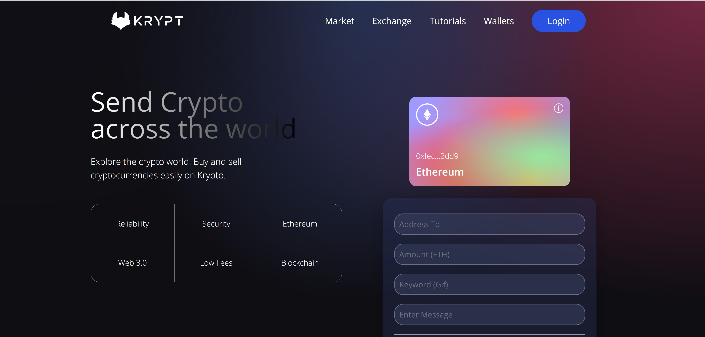

# 🚀 Crypto Banking – dApp Ethereum (2025)

**Une application Web3 moderne permettant d’envoyer des ETH sur Sepolia, avec message + GIF animé.**
Design premium, code propre, architecture claire. 100 % fonctionnelle.

🔗 **Live demo :** *(déploie-la sur Vercel quand tu veux)*
🔗 **Contrat vérifié Sepolia Etherscan**

---

## 🎥 Aperçu

Crypto Banking est une dApp complète qui combine :

* transfert d’ETH
* message personnalisé
* récupération automatique d’un GIF via un keyword
* affichage on-chain de toutes les transactions
* interface glassmorphism + effets violet/noir

Une expérience Web3 fluide, esthétique et pédagogique.

---

## ✨ Fonctionnalités principales

* 🔐 **Connexion Metamask** (également compatible Rainbow, Coinbase Wallet, etc.)
* ⚡ **Envoi d’ETH réel sur Sepolia**
* 📝 **Message + keyword** (serve à récupérer un GIF depuis Giphy)
* 🔄 **Transactions affichées en temps réel**
* 🖼️ **GIF animé automatique selon le keyword**
* 🎨 **Design glassmorphism modernisé (2025 ready)**
* ⛓️ **100 % on-chain** — aucune donnée fictive

---

## 🧩 Stack technique (2025)

| Partie                | Technologie                      |
| --------------------- | -------------------------------- |
| **Frontend**          | Vite • React • Tailwind CSS      |
| **Web3**              | ethers.js v6 • wagmi (optionnel) |
| **Smart Contract**    | Solidity 0.8.17 • Hardhat        |
| **Testnet**           | Ethereum Sepolia                 |
| **Déploiement front** | Vercel / Netlify                 |
| **GIFs**              | Giphy API                        |

---

## 📝 Smart Contract (Sepolia)

**Adresse :** `0x1128e1329bC2F8da020c034562b7ED6a0B08e4A7`
📡 **Voir les événements sur Etherscan**

---

## 📁 Structure du projet

```
crypto-banking/
├── client/                          ← Frontend Vite + React + Tailwind
│   ├── src/
│   │   ├── context/TransactionContext.jsx
│   │   ├── components/Welcome.jsx
│   │   ├── components/Transactions.jsx
│   │   └── utils/constants.js
│   └── public/preview.jpg
│
├── smart_contract/                  ← Hardhat + Solidity
│   ├── contracts/Transactions.sol
│   ├── scripts/deploy.js
│   └── hardhat.config.js
│
└── README.md
```

---

## ⚙️ Installation & lancement

### 1. Cloner le projet

```bash
git clone https://github.com/TON_PSEUDO/crypto-banking.git
cd crypto-banking
```

### 2. Lancer le frontend

```bash
cd client
npm install
npm run dev
```

### 3. (Optionnel) Re-déployer le smart contract

```bash
cd ../smart_contract
npm install
npx hardhat compile
npx hardhat run scripts/deploy.js --network sepolia
```


## 🤝 Contribution

Les contributions sont les bienvenues !
Idées d’améliorations :

* passer totalement à **wagmi + RainbowKit** (UX premium)
* ajouter **historique filtré par adresse**
* mettre un système de **favoris / transactions épinglées**
* migrer le contrat sur **Foundry** (beaucoup plus rapide que Hardhat)

---

## 👤 Auteur

**Wafo KAMGA Steve** – Développeur Web3 Full-Stack
🟣 GitHub : github.com/steve-biko77/


*Fait avec passion, du café, et beaucoup de transactions Sepolia (Novembre 2025).*

